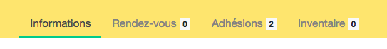

# Modifier son profil 

!!! warning 
    Seul l'utilisateur-trice en question peut modifier son profil 

Pour modifier son profil, cliquer sur le bouton :fa-pencil: vert qui suit le nom du profil.

Il est ici possible d'ajouter d'autres informations autres que celles renseignées lors de la [création du compte](create-account.md).

| Champ | Description |
|:--|:--|
| ```Avatar``` | Choisir une image de profil (par défault, l'image est composée des innitiales de l'utilisateur et d'un fond coloré) |
| ```Date of birth``` | Date de naissance | 
| ```Gender``` | Le sexe/genre de l'utilisateur-trice | 
| ```Bio ```| Une breve description | 
| ```Profile visible ```| Choisir si son profil est visible des visiteurs-trices |

# Détail d'un profil 

Sur la vue détaillée d'un profil, un menu de navigation est visible. 



| Informations | Rendez-vous | Adhésions | Inventaire |
|:--|:--|:--|:--|
| Informations générales | Gestion des rendez-vous. Il est ici possible de voir et d'annuler ses rendez-vous en cliquant sur l'icône *poubelle rouge* qui suit le rendez-vous en question | Voir l'état des adhésions de l'utilisateur-trice. Cette information n'est visible que par l'utilsateur-trice et les membres actifs et administrateurs de l'organisation | [Inventaire personnel](stuffs-device/inventory.md#inventaire-utilisateur) de l'utilisateur-trice |

# Visibilité des profils 

Par défaut un profil n'est pas visible. Vous pouvez rendre votre profil visible en [modifiant votre profil](#modifier-son-profil). 

!!! info "votre profil est tout de même visible sous certaines conditions"
    Effectivement, si vous êtes membre d'une organisaiton, les volontaires, actifs, admnistrateurs peuvent voir voir profil. Cela est nécessaire afin de pouvoir gérer vos adhésions, rendez-vous et inventaire.
