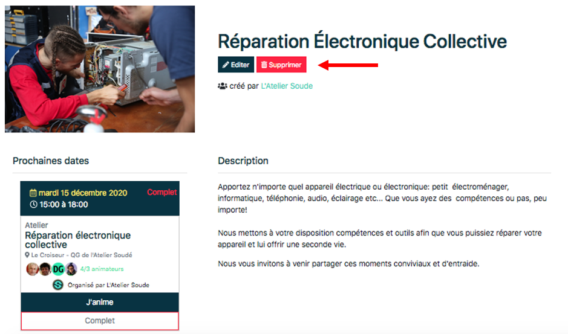

# Parcourir, découvrir

Depuis la page d’accueil, en cliquant sur l’icône ***Activités***, il est possible d’accéder à l’ensemble des activités, toutes organisations confondues, proposées au public. Ces dernières sont classées par catégories (Ateliers de réparations, ateliers de créations, formations, rencontres, ect…). Il est possible de voir par qui sont proposées ces activités mais aussi avoir une vue d’ensemble des différentes activités. En cliquant sur l’activité désirée, il est alors possible d’accéder au descriptif, plus précis et même de s’inscrire au prochain événement proposant l’activité en question.

## Page descriptive d’une activité

Sur cette page on retrouve, l’image illustrant l’activité ; sa thématique, l’organisateur, sa description et ses prochains évènements dans la rubrique ***prochaines dates***. Pour participer à l’un des évènements, il suffit de cliquer sur l’encart de celui-ci et suivre les instructions de la rubrique [***Événements***](../event/reservation.md). Pour les administrateurs il est possible d’éditer et de supprimer sa propre activité.