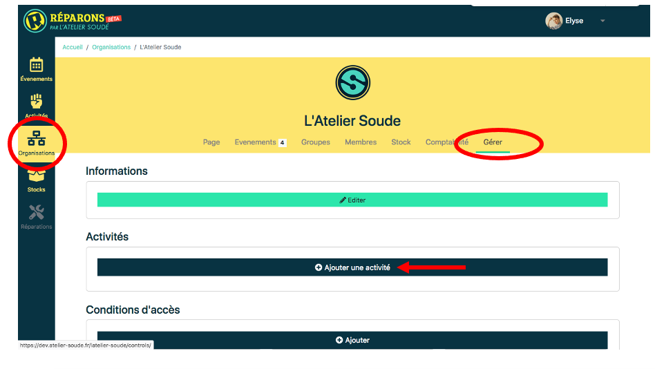

# Créer une activité

Il est indispensable de référencer l’activité proposée par une structure pour pouvoir ensuite créer un événement. Il faut auparavant avoir créé une organisation (cf : créer une organisation) et être administrateur-rice de celle-ci. Une fois cette étape réalisée, cliquer sur l’onglet ***Organisations*** dans le menu latéral gauche de l’accueil. Choisir son organisation.

Sur la page de présentation de l’organisation, accéder à la création d’une activité via l’onglet ***gérer***. Cliquer sur ***+ Ajouter une activité***.

Pour la ***création d’une nouvelle activité*** : remplir les différents champs du formulaire.

1. ***activity type*** (FR : type d’activité) : ici donner un titre précis à l’activité (ex : Atelier de Réparation participative électronique »
2. ***category*** (FR : catégorie) : dans le menu défilant choisir le type d’activité (ex : formation). Champs non-obligatoire, mais conseillé pour le référencement des activités.

3. ***activity description*** (FR : Description de l’activité) : écrire une description précise de l’activité. Le texte peut être mise en forme via les différents outils proposés. Champ obligatoire à renseigner.
4. ***image*** : appuyer sur le bouton sur ***parcourir*** pour télécharger une image illustrant l’activité. Champ non-obligatoire mais conseillé pour l’identification des différentes activités.

Pour finaliser, l’enregistrement de l’activité, cliquer sur le bouton vert ***valider***.
A présent, l’activité est créée et répertoriée dans le menu ***activités***.