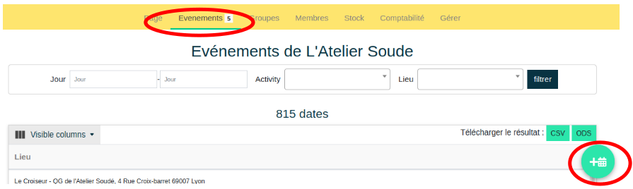

# Créer un événement

!!! info "Seul l'administrateur peut créer des évènements."

Cela se fait depuis l’onglet «**Organisation**» → Choisir l’association organisatrice → «**Evénement**» → «**Ajouter un événement**»

Il est possible d’ajouter des événements de manière ponctuelle ou récurrente.

Il est ensuite nécessaire de renseigner des informations de bases telles que le type d’activité, le nombre de participants, d’animateurs, le lieu, la date et horaire, un descriptif. A cela s’ajoute des options spécifiques telles que les conditions d’inscription, le renseignement par l’utilisateur de l’appareil à réparer…

Pour créer un évènement, certains objets doivent au préalable exister, sans lesquels il ne sera pas possible de créer un événement :

- **Activity** : choisir une activité dans le menu déroulant. L'activité doit faire partie de celles enregistrées par l'association. Si l'événement est une nouvelle activité (qui n'est donc pas visible dans le menu), il faut d'abord la créer dans le catalogue des activités. La démarche est détaillée dans la partie "**Activité**" - "**Création**" .

- **Pas de limite de place** : permet une inscription illimitée de participants

- **Places disponibles** : ce champ permet de définir le nombre de participants (hors bénévoles) pouvant assister à l'événement. Le nombre d'inscription ne pourra dépasser cette valeur.

- **Réservation interne au site** : permet l'inscription à l'événement depuis le site

- **Souhaitez vous gérer des réparations** : offre la possibilité aux participants d'informer des objets qu'ils ont à réparer

- **En association avec** : Si l'événement se fait en partenariat avec un autre acteur, il est possible de le nommer ici.

- **Réservation externe au site** : Permet d'empêcher la réservation par le site et informe de la démarche à suivre renseignée dans le champ suivant

- **Lien vers un site externe** : Zone pour informer et rediriger l'utilisateur vers le moyen de réservation.

- **Description supplémentaire de l'activité** : si la description de l'activité ne convient pas (celle renseignée lors de la création de l'activité), il est possible de la remplacer par ce qui sera écrit dans ce champ.

- **Lieu** : choisir un lieu parmi ceux proposés. S'il est nouveau et n'apparait pas dans le menu déroulant, il est d'abord nécessaire de le créer parmi les lieux des associations. La démarche est détaillée dans la partie "**Organisation**" - "**Gérer**"

- **Date** : mettre la date de l'événement

- **Starts at** : mettre l'horaire de début de l'événement. A partir de cet horaire, la page de gestion de l'événement sera disponible en cliquant sur celui ci depuis l'onglet "**Événement**".

- **Ends at** : mettre l'horaire de fin. Une fois cet horaire atteint, l'événement s'archivera automatiquement et ne sera plus visible depuis l'onglet événement. Il est accessible depuis "**Organisation**" - l'association organisatrice - "**Événement**"

- **Nombre d'animateurs attendus** : Informe du nombre de bénévoles attendus. Ce nombre ne limite pas le nombre d'inscription

- **Organizers** : permet d'ajouter des animateurs pendant la création de l'événement.

- **Conditions** : choisir une ou plusieurs conditions parmis celles référencées. Si une nouvelle condition est requise, il faut d'abord la créer depuis "**Organisation**" - l'association organisatrice" - "**Gérer**" - "Conditions d'accès". La démarche est détaillée dans la partie "**Organisation**" - "**Gérer**"

## Créer un événement récurrent

Il peut être publié sur la plateforme de façon unique ou être publié de façon récurrente : par semaine, par mois etc. et publié 2 jours, 1 semaine ou 2 semaine à l'avance.

!!! danger "Publication des évènements"
    Les événements ne sont pas publiés automatiquement, une tâche d'arrière plan publie les événements toutes les heures. Il faudra peut être patienter pour voir le/les événements nouvellement créés.

