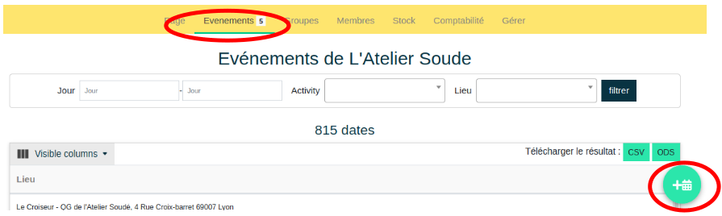

# Créer un événement

## Accéder au formulaire

!!! info "Qui peut créer un événement ?"
    Seul les membres actifs-ves et administrateurs-rives d'une organisation peuvent le faire. Voir [gestion des groupes](../organization/groups.md)

**url** 
```
/<nom_organization>/events/
```

Page ***Organisation*** → *Choisir l'organisation* → ***Evénement*** → ***Ajouter un événement***





Il est possible d’ajouter des **événements ponctuels ou récurrents**. Il existe deux formulaires différents, accessibles en bas de cette page.


Ces deux formulaires utilisent ce même [formulaire](#formulaire) décrit ci-dessous. Le formulaire de création [d'événements récurrents](#evenement-recurrent) inclut des champs supplémentaires.


## Formulaire de création 

!!! warning "Certaines entités doivent exister au préalable"
    Vous ne pourrez pas créer d'événements s'il n'existe pas de type d'activité ni de lieu : voir [créer une activité](../activity.md), [créer un lieu](../location.md)

| Champ | description |
|:--|:--|
|  ```Activity``` | Liste déroulante autocomplétive. La liste des activités est celle de toutes les activités créées par les organisations. Si l'événement est une nouvelle activité, il faut d'abord la créer dans le catalogue des activités. Voir [créer une activité](../activity.md) |
| ```Pas de limite de place*``` | L'événement n'a pas de limitation de place et permet donc une inscription illimitée. |
| ```Places disponibles``` | Ce champ permet de définir le nombre de participant-e-s (hors animateurs-trices) pouvant assister à l'événement. Le nombre d'inscriptions ne pourra dépasser cette valeur |
| ```Réservation interne au site``` | Permet l'inscription à l'événement depuis le site |
| ```Souhaitez vous gérer des réparations``` | Offre la possibilité aux participant-e-s d'informer les objets qu'ils apportent à réparer |
| ```En association avec``` | Champ texte libre. Si l'événement se fait en partenariat avec un autre acteur, il est possible de le nommer ici |
| ```Réservation externe au site``` | Permet d'empêcher la réservation via la plateforme (exemple : réservation par un autre site, ou réservation sur place ...). Voir champ suivant |
| ```Lien vers un site externe``` | Si l'option précédente est cochée, l'utilisateur-rice est redirigé-e vers cette URL. Sinon, le lien s'affiche simplement dans le détail d'un événement |
| ```Description supplémentaire de l'activité``` | Remplace la description de l'activité (celle renseignée lors de la création de l'activité) par le contenu de ce champ |
| ```Lieu``` | Liste déroulante auto-complétive. La liste des lieux est celle de tous les lieux créés par les organisations. Choisir un lieu parmi ceux proposés. S'il est nouveau et n'apparait pas dans le menu déroulant, il est d'abord nécessaire de le créer parmi les lieux des associations. Voir [créer un lieu](../location.md) |
| ```Date``` | La date de l'événement |
| ```Starts at``` | Horaire de début de l'événement. A partir de cet horaire, les fonctionnalités de [gestion de l'événement](manage-event.md) seront disponibles |
| ```Ends at``` | Horaire de fin. Une fois cet horaire atteint, l'événement s'archivera automatiquement et ne sera plus visible depuis la page commune des événements. Il est accessible depuis ***Organisation*** - *l'association organisatrice* - ***Événement*** |
| ```Nombre d'animateurs attendus``` | Indique le nombre d'animateurs-rices attendu. Ce nombre ne limite pas le nombre d'inscriptions |
| ```Organizers``` | Liste multiple auto-complétive. Permet d'ajouter des animateurs-rices pendant la création de l'événement |
| ```Conditions``` | Liste multiple auto-complétive. Permet de choisir une ou plusieurs conditions parmi celles référencées. Si une nouvelle condition est requise, il faut d'abord la [créer](../organization/manage#condition-dacces). Les conditions ne sont pas restrictives. [Voir de quoi il s'agit](../organization/manage#condition-dacces). |

!!! info "Attention"
    Le format de la date et les horaires de l'événement dépendent de la configuration linguistique de votre système.

## Evénement récurrent

Le formulaire de création d'événement comporte des champs supplémentaires qui permettent de définir la règle de récurrence. 

| Champ | description |
|:--|:--|
| ```Par``` | Récurrence par semaine/mois |
| ```Date de début``` | Date de début de la règle de récurrence |
| ```Jour(s)``` | A renseigner si *par semaine* est sélectionné. Options lu/mar/mer/jeu/ven/sam/dim |
| ```La ou les semaines``` | A renseigner si *par mois* est sélectionné. Options semaine 1/2/3/4/5 |
| ```Date de fin``` | Date de fin de la règle de récurrence |
| ```Publication``` | Date de publication de l'événement, à rebours de la date de l'événement (exemple : publication 2 semaines avant l'événement). Options 1/2 jours, 1/2/3/4/5/6 semaines |

## Publication

Lorsque le formulaire est soumis, le(s) événement(s) ainsi créés sont enregistrés et une tache de fond se charge de les publier.

!!! danger "Publication des évènements"
    Les événements ne sont pas publiés automatiquement, la tache de fond publie les événements toutes les heures. Il faudra donc patienter pour voir le/les événements nouvellement créés.

Les événements qui ne sont pas encore publiés restent visibles sur [l'onglet des événements d'une organisation](event-index.md). 
Il est possible d'afficher l'état de publication des événements en rendant visible la colonne **Published** dans ce tableau. 