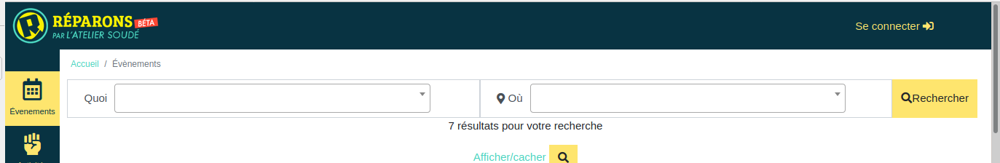
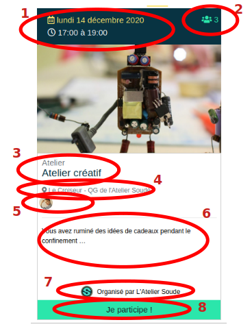

# Parcourir / découvrir

## Liste des événéments 
Cette page événement donne accès à tous les événements à venir qui sont planifiés par les associations de l'application. Les événements antérieurs sont accessibles depuis "Organisation" - l'association organisatrice - "Événement".

Une 1ère section permet de rechercher spécifiquement un type d’événement ainsi qu’un lieu.

Ensuite viennent les événements avec :

1. La date
2. Le nombre de places disponibles
3. L’intitulé de l’événement
4. Le lieu
5. Les animateurs
6. Le descriptif de l’événement
7. L’association organisatrice
8. Le lien d’inscription

## Détail d'un événement 

