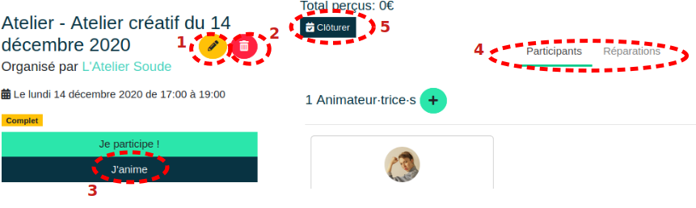

# Gérer l'événement

## Modification de l'évènement

Une fois l’événement créé, il est possible de le modifier en accédant à cet événement depuis l’onglet "**Evénement**". Ensuite le crayon **(1)** permet de le modifier tandis que la poubelle **(2)** permet de le supprimer.

## Inscription des animateurs-rices

Pour l’encadrement des participant-e-s, les membres actifs-ves de l’association peuvent s’inscrire en tant qu’animateur-trice grâce à la touche «**J’anime**» **(3)**. La touche «**Je participe**» est dédiée aux participant-e-s.

Les participant-e-s ainsi que les réparations à faire sont visibles grâce aux onglets du même nom **(4)**.

## Pendant l'évènement

A l’horaire de l’événement, sa page évolue et permet sa gestion administrative. Le site permet de valider la présence des participant-e-s grâce à la touche «**✓**» en haut à gauche de son nom. S’ouvre alors automatiquement le formulaire d'ajout/mise à jour de membres décrit dans la section [Gestion des membres](../organization/members.md)

En effet, lors de l’inscription, seule une adresse mail est requise. C’est lors de sa 1ère présence à un événement qu’un compte est créé. Dès lors, il faut renseigner le nom et le prénom de la personne participante.

Finalement, à la fin de l’événement, il est nécessaire de le clôturer grâce à la touche éponyme **(5)** afin d’enregistrer les informations (de créer les abonnements et créer les cotisations associées). La clôture de l'événement va également supprimer de la base de données les comptes mails rattachés aux personnes n'ayant pas participé.

L’événement s’archive automatiquement une fois l’horaire de fin atteint.

## Fin de l'évènement

