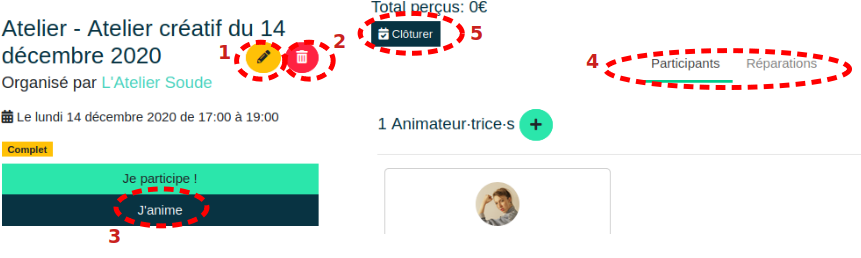

# Gérer l'événement

## Modification de l'événement

Une fois l’événement créé, il est possible de le modifier en accédant à cet événement depuis l’onglet ***Evénement***. Ensuite le crayon **(1)** permet de le modifier tandis que la poubelle **(2)** permet de le supprimer.

## Inscription des animateurs-rices

Pour l’encadrement des participant-e-s, les membres actifs-ves de l’association peuvent s’inscrire en tant qu’animateur-trice grâce à la touche ***J’anime*** **(3)**. La touche ***Je participe*** est dédiée aux participant-e-s.

Les participant-e-s ainsi que les réparations à faire sont visibles grâce aux onglets du même nom **(4)**.

## Pendant l'évènement

A l’horaire de l’événement, sa page évolue et permet sa gestion. Le site permet de valider la présence des participant-e-s grâce à la touche ***✓*** en bas à gauche de la carte utilisateur. S’ouvre alors automatiquement le **formulaire d'ajout/mise à jour de membres** décrit dans la section [Gestion des membres](../organization/members.md#ajout-mise-a-jour-de-membre) pour assurer l'exactitude des informations (si la personne est membre), ou compléter si la personne ne s'est inscrite qu'avec son adresse mail (pour devenir membre).

En effet, lors de la réservation, il est possible de ne donner qu'une adresse mail. C’est lors de sa 1ère présence à un événement qu’un compte est créé. Dès lors, il faut renseigner le nom et le prénom de la personne participant à l'événement.

## Fin de l'évènement

A la fin de l’événement, il est nécessaire de le clôturer grâce à la touche **(5)** afin d’enregistrer les informations saisies (de créer les affiliations et enregistrer les cotisations associées). La clôture de l'événement va également supprimer de la base de données les comptes rattachés aux personnes n'ayant pas participé, mais uniquement si elles ne possèdent pas de compte membre (ie. si elles se sont enregistrées avec uniquement une adresse mail). Il est possible de clôturer plusieurs fois un évènement en cas d'oubli.

Une fois l'horaire de fin atteint, l'événement n'est plus visible dans la liste publique des événements mais reste consultable dans l'onglet [Evènements](../organization/org-index.md) de la page de l'organisation.