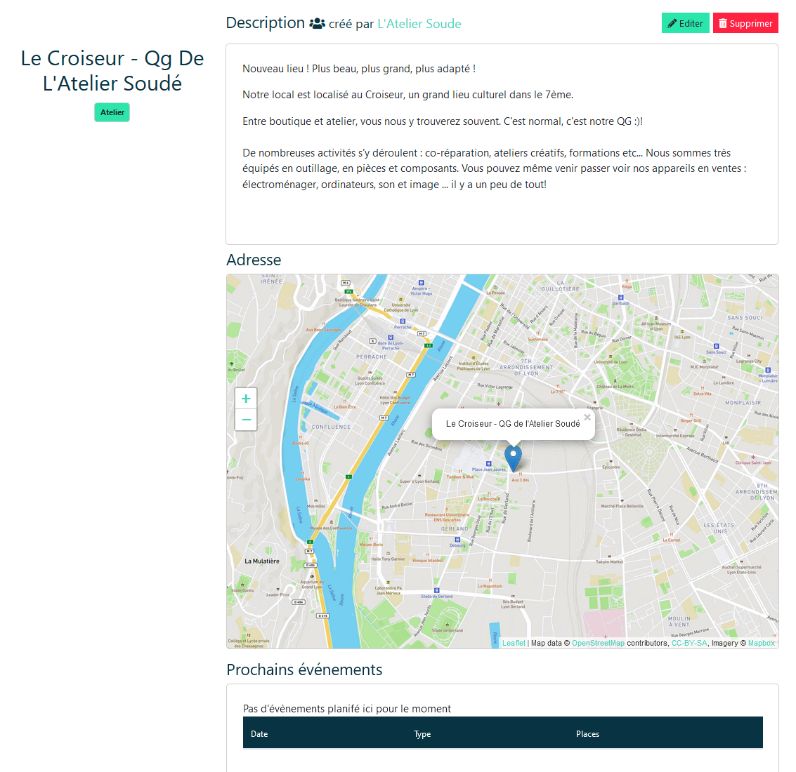
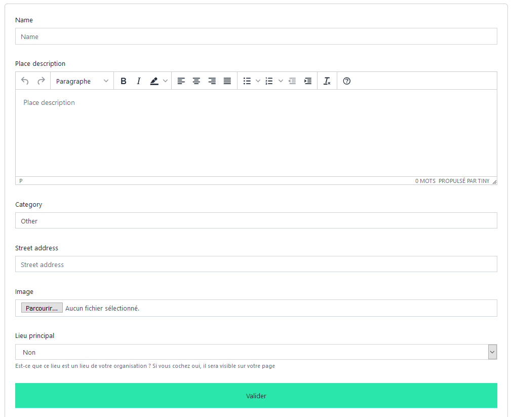

# Lieux

## Description générale

La plateforme gère les lieux comme des entités similaires à celles liées aux activités. Cela signifie qu'une organisation peut utiliser n'importe quel lieux, mais seul-e-s les administrateurs-rices de l'organisation de rattachement peuvent le modifier ou le supprimer.

## Page de présentation

Les lieux sont rattachés à une page de présentation comme celle-ci :



Cette page est accessible par la page d'un évènement se déroulant dans ce lieu, ou par la page de présentation d'une organisation, qui ne permet d'accéder qu'aux lieux déclarés ***Lieu Principal*** dans le formulaire ci-dessous.

## Formulaire de création/modification d'un lieu

!!! info "Formulaire accessible uniquement aux administrateur-rices d'une organisation"
    De plus, la modification d'un lieu est réservé aux administrateurs-rices de l'organisation qui a créé le lieu.


La création (par la [page ***Gérer*** d'une organisation](organization/manage.md#lieux)) ou la modification (par la page de présentation d'un lieu ou par la [page ***Gérer*** d'une organisation](organization/manage.md#lieux)) d'un lieu se fait par le formulaire de création/modification d'un lieu : 



| Champ | Description |
|:--|:--|
| ```Name``` | Nom du lieu |
| ```Place description``` | Description du lieu |
| ```Category``` | Type de lieu (par ex : centre social, squat, médiathèque ...) |
| ```Street Adress``` | Adresse du lieu |
| ```Image``` | Le bouton ***parcourir***  permet de télécharger une image illustrant le lieu. Champ facultatif mais conseillé pour l’identification du lieu |
| ```Lieu Principal ``` | Permet de déclarer le lieu comme _Lieu Principal_ de l'organisation, ce qui le fera apparaître sur la page de présentation de l'organisation. |


## Suppression d'un lieu

La suppression d'un lieu se fait soit en cliquant directement sur le bouton ***Supprimer***, situé soit sur la page de présentaion d'un lieu, soit dans la section lieux de la [page ***Gérer*** d'une organisation](organization/manage.md#lieux).

déplacer ici ce qui concerne les lieux ( ce qui est déjà dans orga/gérer)

+ rajouter mention de la map 

faire page comme activité