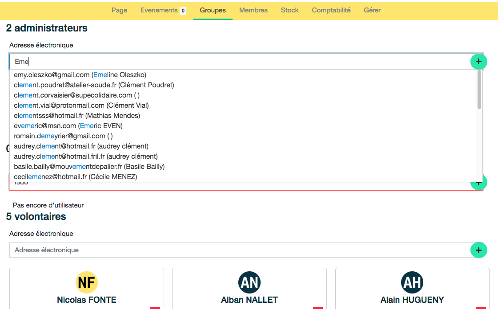

# Groupes 

La page ***Groupes*** permet d'attribuer des rôles aux utilisateur-trices. 

La page ***Groupes*** illustre les 3 types de membres d'une organisation : Administrateur-rice, Membre actif-ve, Volontaire (classé par privilèges décroissants sur l'application). Chaque membre a la possibilité d'agir sur les groupes de personnes ayant un niveau de privilège inférieur ou égal au sien :

- Un-e administateur-trice peut créer des administrateur-trices, actif-ve-s et des volontaires, ainsi que supprimer leurs droits
- Un-e actif-ve peut ajouter des actif-ves et volontaires 
- Un-e volontaire peut ajouter des volontaires 

Pour l'ajout d'un-e utilisateur-trice dans un groupe, celui-ci ou celle-ci doit obligatoirement [posséder un compte](../account/create-account.md) sur l'application. Il est ensuite possible de l'ajouter gràce à un champ autocomplétif.

Les droits sont différents selon les groupes. Les niveaux supérieurs d'autorisation peuvent réaliser les actions des niveaux inférieurs. Ces droits ne sont donc pas ré-inscrits dans le tableau ci-dessous:

| Niveau de privilèges | Autorisations |
|:--|:--|
| Administrateur-rice  | Créer, modifier, supprimer : organisation, lieux, activités, conditions, événements |
| Membre actif-ve | Créer et modifier un événement, [Gérer un événement](../event/manage-event.md). Créer et modifier des membres  |
| Volontaire | S'inscrire en **animateur-rice** d'un événement. Créer et modifier des objets. | 

