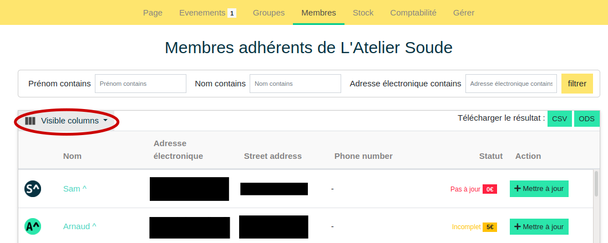

# Gestion des membres

Sur cete page, il est possible d'accéder aux informations des adhérent-e-s. Le menu déroulant ***Visible columns*** permet de choisir les informations affichées. Cliquer sur un membre permet de voir son profil.

Comme indiqué dans la rubrique [Groupes](groups.md), les membres sont répartis sur 3 niveaux de privilèges : **Volontaire**, **Membre actif-ve** et **Administrateur-rice**. Le détail de ces niveaux est expliqué dans la rubrique [Groupes](groups.md).

Sur la page **Membres**, il est possible d'accéder aux informations des adhérent-e-s. Le menu déroulant "Visible columns" permet de modifier le nombre d'informations visibles. La page possède un filtre de **Nom**, **Prénom**, **Mails** qui peut aider à retrouver un membre.



## Ajout, mise à jour de membre

!!! info "Cette fonctionnalité n'est accessible qu'aux membres actifs-ves et administrateurs-rices de l'organisation. [gestion des groupes]("organization/groups.md")"

L'ajout de nouveaux-elles membres se fait avec la touche ***+*** verte en bas à droite, la mise à jour en cliquant sur ***Mettre à jour***  au bout de la ligne. Il conduit au **formulaire d'ajout/mise à jour de membre** suivant : 


Il est nécessaire de renseigner au moins, `adresse électronique`, `nom` et `prénom` pour ajouter un-e membre. Les autres champs sont falcultatifs pour la création d'un profil. L'ajout d'un-e membre entraîne en réalité la création d'un compte utilisateur et l'affiliation de celui-ci à l'organisation. 

!!! warning "Avant d'enregistrer un-e membre, il est conseillé de rechercher si il-elle n'est pas déjà présent-e grâce au champ d'autocomplétion prévu à cet effet."
    Entrer une adresse mail existante aura pour effet d'écraser le compte utilisateur correspondant avec les nouvelles informations fournies

Ce formulaire permet également de mettre à jour les informations d'un-e membre, notamment sa cotisation (champ ```Amount paid```). A la saisie de la première cotisation, à la date indiquée, l'application considèrera comme ***A jour*** (si la personne a versé le montant indiqué dans ```Advised Contribution``` dans le [formulaire de modification de l'organisation](manage.md)) ou ***Incomplet*** (si la personne a versé moins) le-la membre pendant une durée de un an.

Cependant il est possible de réinitialiser ce décompte et repartir pour un an en cochant la case ``First fee`` (FR : première cotisation). Cette fonctionnalité peut être utile pour mettre à jour un-e membre qui paye sa cotisation en plusieurs fois, ou pour quelqu'un qui ne cotise réellement qu'au bout de plusieurs rendez-vous.

En cas d'erreur sur l'entrée d'une cotisation, il est possible de modifier le champ ``Amount paid`` en revenant dans ce formulaire par l'intermédiaire d'une page évènement ou de la gestion des membres.