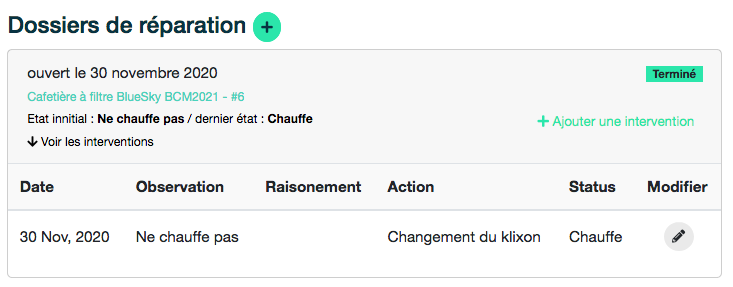

# Réparer 


## Voir un dossier 

Un dossier de réparation est toujours relatif à un [objet](how-it-works.md#objet). Pour voir un dossier, il est nécessaire de se rendre sur le [détail de l'objet](how-it-works.md). 

Un dossier se présente ainsi : 



Pour voir les interventions associées, il faut déplier l'accordéon en cliquant sur ***voir les interventions***. 

## Ajouter un dossier 

Pour ajouter un dossier, cliquer sur le bouton :fa-plus: qui suit ***Dossiers de réparations***

!!! info "Qui peut créer un dossier ?"
    L'utilisateur-rice propriétaire, les volontaires, les actifs-ves et les administrateurs-rices des organisations dont le-la propriétaire est membre. Si le-la propriétaire est une organisation, ses membres peuvent également créer un dossier.
    


Ce formulaire reprend les champs décrivant un [dossier de réparation](how-it-works.md#dossier-de-reparation). 

Il faut indiquer une ```date d'ouverture``` et préciser si le dossier est en cours ou non. 

Il est nécessaire de **renseigner à minima une observation**. Cette observation consistera en l'état initial de l'objet lors de l'ouverture de ce dossier. 


## Ajouter/modifier une intervention

Pour ajouter une intervention à un dossier, cliquer sur le lien ***ajouter une intervention*** inclu dans un dossier de réparation.

Pour modifier une intervention, cliquer sur le bouton d'édition :fa-pencil: qui suit la ligne décrivant l'intervention. 

!!! info "Qui peut ajouter/modifier ?"
    L'utilisateur-rice propriétaire, les volontaires, les actifs-ves et les administrateurs-rices des organisations dont le-la propriétaire est membre. Si le-la propriétaire est une organisation, ses membres peuvent également ajouter/modifier une intervention.


Ce formulaire reprend les champs décrivant une [intervention](how-it-works.md#intervention). 

Outre la date de l'intervention et ses actions disponibles sous forme de champ d'autocomplétion, il est possible d'indiquer si cette intervention à eu un impact sur le dossier et son objet : 

* Si l'intervention clos le dossier. Le dossier passera donc du status **en cours** à **terminé**. 
* Si l'intervention modifie l'état général de l'objet. Une liste de choix d'état apparaît. L'état de l'objet sera ainsi modifié en conséquence. 
